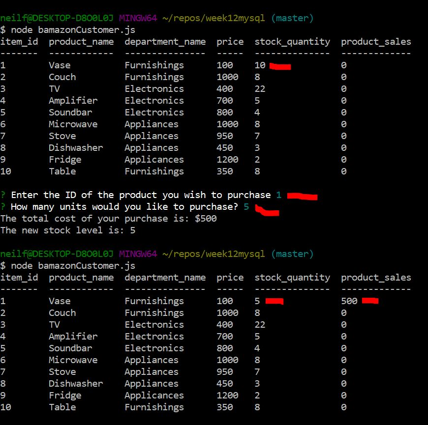
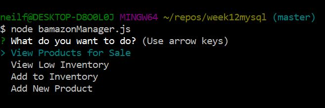
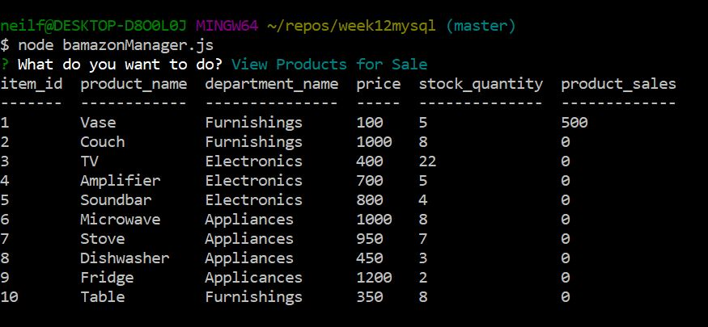
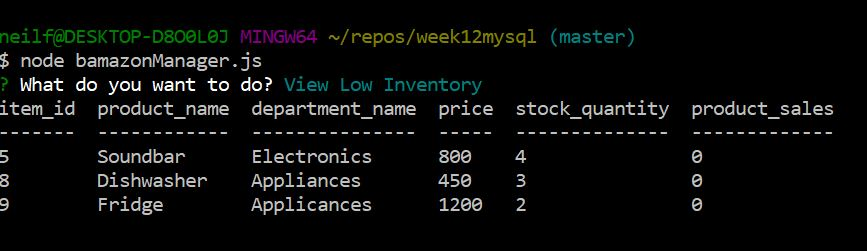
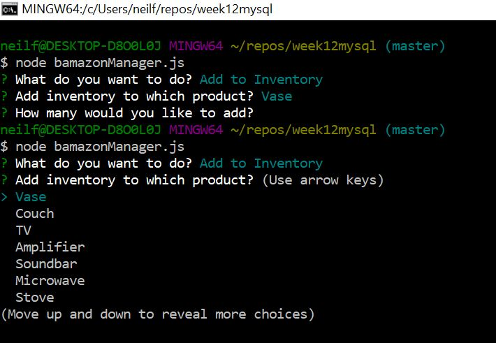
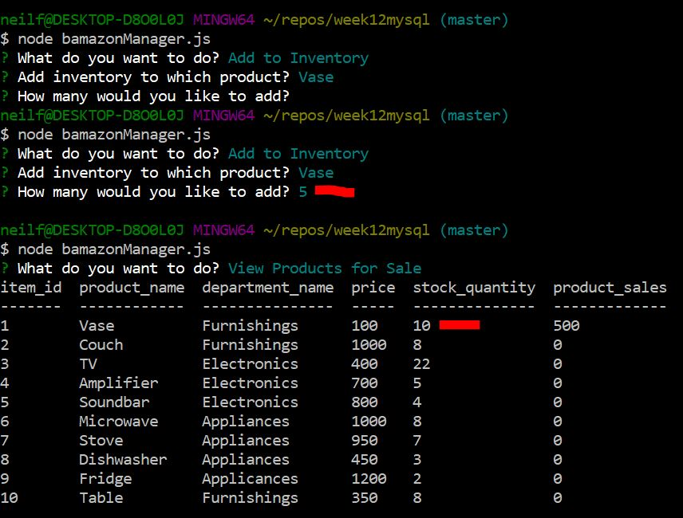
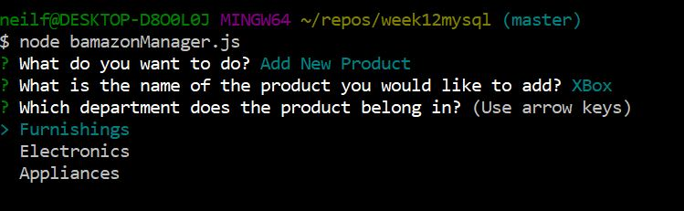
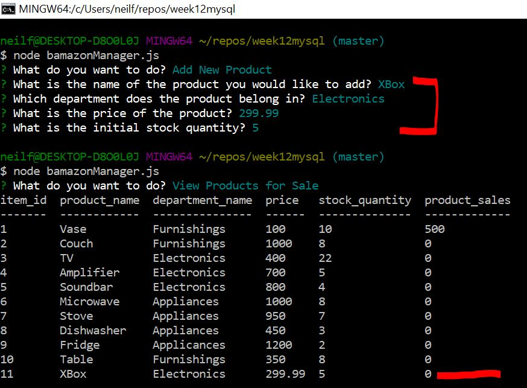

# week12mysql
simple command line order and inventory system comprised of javascript, node packages and mysql
## node packages
* inquirer
* mysql
* console.table

## javascript files
### bamazonCustomer.js
* Displays products for sale and stock levels
* Allows user to order a quantity of a product
### bamazonManager.js
* Displays products for sale and stock levels
* Displays low stock products (less than 5 items in stock)
* Allows user to add stock to a product
* Allows user to add a new product to the products for sale
### bamazonSupervisor.js
* Allows user to view sales and profit by department
* Allows user to add new a new department

## mysql script files
* dbcreate.sql
* addproducts.sql
* adddepartments.sql
* select products.sql
* selectndepartments.sql

## screenshots - in execution order
* CustomerOrder.JPG
* 
* ManagerMenu.JPG
* 
* ManagerViewProducts.JPG
* 
* ManagerViewLowStock.JPG
* 
* ManagerAddInventory1.JPG
* 
* ManagerAddInventory2.JPG
* 
* ManagerAddProduct1.JPG
* 
* ManagerAddProduct2.JPG
* 
* DepartmentsBeforeAdd.JPG
* 
* DepartmentsAfterAdd.JPG
* 
* SupervisorMenu.JPG
* 
* SupervisorViewProduct.JPG
* 
* SupervisorAddDept.JPG
* 
